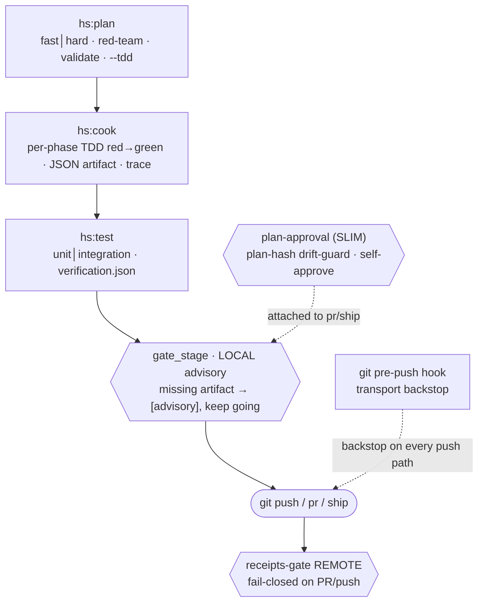
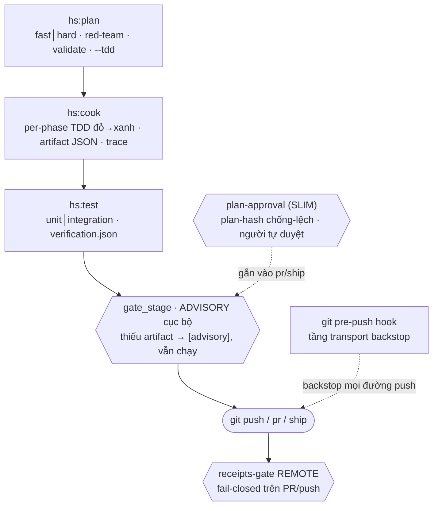

# SDLC Harness

A two-tier, **file-based SDLC discipline for Claude Code** — skills + hooks + scripts + rules dropped into each developer's repo so that code written by agents (or humans) **follows the pipeline** (plan → code → test → ship) and **stays on the organisation's shared standard**.

**This repository is both the interactive showcase _and_ the versioned public release** of the harness.

<div align="center">

### 🎮&nbsp; [▶ Open the live interactive showcase](https://hieubui2409.github.io/sdlc-harness-release/) &nbsp;🎮

Animated, **bilingual (EN/VI)** tour of every feature — the skill catalog, the three hook tiers, the pipeline, the gates, install flows and distribution. Runs straight in your browser, no build step, no network calls. *(Prefer local? Open [`index.html`](index.html).)*

**[⬇ Download the latest release](https://github.com/hieubui2409/sdlc-harness-release/releases/latest)** &nbsp;·&nbsp; install bundle · `install.sh` / `install.ps1` · SBOM

</div>

> 🇬🇧 **English** below · 🇻🇳 **Tiếng Việt**: cuộn xuống mục **[Tiếng Việt](#tiếng-việt)**.
>
> The harness source itself (`harness/`, `docs/`, `plans/`, ~130k LOC Python, ~7,900 tests) lives in a **private** repo. **This public repo is the shop window + the delivery dock**: the interactive showcase (GitHub Pages) and the signed, versioned release bundles you install from.

---

## What this repo is

| | |
|---|---|
| 🎮 **Showcase** | A standalone bilingual site published to **GitHub Pages** — [hieubui2409.github.io/sdlc-harness-release](https://hieubui2409.github.io/sdlc-harness-release/). Every feature as an interactive page: catalog, hooks, pipeline, install, vision. |
| 📦 **Release** | Every version is cut as a **GitHub Release** (`harness-v<version>`) with a deterministic install bundle — `harness-v<version>.tar.gz` (+ `.sha256`), a POSIX `install.sh`, a PowerShell `install.ps1`, and an `sbom.json`. |

## Install from the latest release

One `install.sh` (+ `install.ps1`) dispatches on its argument: **give a URL → it downloads that URL; give a local `.tar.gz` → it installs that offline; give nothing → it fetches the latest release.**

**One-liner** — run inside the repo you want to harden; it self-downloads the latest bundle and installs it (requires Python ≥3.9 + git + Claude Code on the target):

```bash
# Linux / macOS / WSL
curl -fsSL https://hieubui2409.github.io/sdlc-harness-release/install.sh | sh -s -- . --skip-tests
```

```powershell
# Windows — PowerShell 5.1 or 7+
irm https://hieubui2409.github.io/sdlc-harness-release/install.ps1 | iex
```

`-s --` is required so args reach the script over stdin. Pin a version with `HARNESS_VERSION=5.1.2` (env) or `-Version 5.1.2` (ps1).

**Pick a version + preview its changelog** (`-i` / `-Interactive`) — lists the releases, lets you choose, shows that version's changelog, then confirms before installing (reads `/dev/tty`, so it works even when piped):

```bash
curl -fsSL https://hieubui2409.github.io/sdlc-harness-release/install.sh -o install.sh && sh install.sh -i
```

**Prefer to verify first?** Don't pipe blindly. Read the bootstrap, then dry-run it, or go fully manual:

```bash
curl -fsSL https://hieubui2409.github.io/sdlc-harness-release/install.sh -o install.sh && less install.sh
sh install.sh . --dry-run          # print exactly what it WOULD fetch (URLs + expected sha256), install nothing
# pass an explicit tarball URL:
sh install.sh https://github.com/hieubui2409/sdlc-harness-release/releases/download/harness-v<version>/harness-v<version>.tar.gz .
# or fully manual — grab the assets from the Releases page, verify, inspect, install offline:
sha256sum -c harness-v<version>.tar.gz.sha256      # must print "OK"
tar tzf harness-v<version>.tar.gz | less           # inspect the tarball
sh install.sh harness-v<version>.tar.gz <target-repo>   # give a tarball → offline branch
```

Every path hands off to the same installer: verify sha256 → block tar-escape → check deps → install → verify by hash (`--strict`) → run the bundled test suite (`--skip-tests` to skip). An `sbom.json` ships with each release for component review. Assets are always available on the [**Releases**](https://github.com/hieubui2409/sdlc-harness-release/releases/latest) page; the short URLs are served from GitHub Pages.

## Core ideas

1. **Two layers of control.** An **instruction layer** (prose skills/rules that guide the agent to do the right thing) plus a **runtime gate layer** (hooks that block for real at `PreToolUse` — they don't trust prose, they check artifacts). Every declared gate must have real wiring.
2. **Distributed multi-user.** One dev, one machine, one clone, one harness each. What's shared is the **standard** (system-architecture + code-standards) loaded as input on every machine — not many people on one machine.
3. **Trace everything, be honest about limits.** Every gate/approval/decision emits an `actor`-stamped event into an append-only audit log. Limits are stated in the contract itself: a gate is a *presence gate* (guards against skipped steps, not fraud), the actor is *attribution* (not authentication), the config gate is *tamper-visible* (editable in an emergency, but it leaves a trace).

## The `hs:*` skills

Everything ships inside one `hs` plugin, invoked as `/hs:<name>`. **118 skills** grouped by family:

| Family | Skills |
|---|---|
| **SDLC backbone** | `plan` · `cook` · `test` · `ship` |
| **Orchestration** | `discover` · `triage` · `understand` · `team` · `find-skills` |
| **Quality / review** | `code-review` · `review-pr` · `security-scan` · `scenario` · `predict` · `eval-bootstrap` |
| **Debug / fix** | `debug` · `fix` · `problem-solving` |
| **Research / knowledge** | `research` · `scout` · `repomix` · `docs-seeker` · `graphify` · `tech-graph` · `context-engineering` · `sequential-thinking` · `fable-thinking` |
| **Product / advisory (PO·BA)** | `spec` · `shape` · `advise` · `issue-to-plan` |
| **Second engine / agent coordination** | `partner` · `gemini` · `coding-agent-orchestration` |
| **Ideas / decisions** | `brainstorm` · `loop` · `prompt` |
| **Docs / diagrams** | `docs` · `journal` · `retro` · `preview` · `mermaidjs` · `excalidraw` · `document-skills` |
| **Primitive authoring (building the harness itself)** | `skill-creator` · `harness-creator` · `mcp-builder` · `agentize` · `bootstrap` |
| **Project operations** | `project-management` · `project-organization` · `plans-kanban` · `git` · `worktree` |
| **Autonomous (AFK)** | `afk` |

Skills are only prose guidance — the real enforcement lives in hooks + scripts. **13 core skills** (`plan·cook·test·ship·fix·debug·code-review·review-pr·git·scout·understand·setup·triage`) are always on and cannot be disabled; together with `use`/`find-skills`/`cleanup` they form the **16-skill always-on floor**. The remaining 102 skills of the broader catalog (including non-SDLC branches — frontend/mobile/media…) are **off by default** and enabled on demand via `/hs:use <name>` or `/hs:find-skills`.

## Three hook tiers

| Tier | Default | On error | Role |
|---|---|---|---|
| `telemetry` | ON | silent fail-open | record |
| `nudge` | OFF | advisory stderr | remind |
| `compliance` | **ON + blocking** | **fail-closed** exit 2 + how-to-fix | enforce |

The tier is baked into each hook's code — config (`harness-hooks.yaml`, git-tracked) only toggles on/off and mode; it can never change a hook's tier.

## Standard workflow

Local gates are **advisory-first** (a missing artifact prints `[advisory]` + traces `gate_advisory`, then lets you continue) — the hard stop is enforced **remotely**: a `receipts-gate` workflow that runs **fail-closed** on PR/push.



Every gate/approval/claim emits an `actor`-stamped trace into an append-only audit log; telemetry measures skill/script runs and declared-vs-actual skill chains. Report language is configurable (defaults to Vietnamese) and passes a humanizer rule before it's finalised.

## Two install models

The harness ships in **two install models** — **project** (copy the whole tree into each repo) and **global** (one shared binary via `$HARNESS_BIN_ROOT`, per-project data) — plus a newer **courier** flow that delivers the global model as a Claude Code marketplace plugin. The showcase's [install page](https://hieubui2409.github.io/sdlc-harness-release/pages/install.html) walks through all three.

## Vision

Two-tier control, **local + remote**: keep the one-clone-per-dev model, and add an optional sidecar server so teams/enterprises can centralise **policy, telemetry, and signed gate approvals** (Ed25519) — offline-first, fail-safe, never locking up when the server is away.

---

<a name="tiếng-việt"></a>

## Tiếng Việt

Bộ kỷ luật SDLC **file-based cho Claude Code** — skills + hooks + scripts + rules cài vào repo của từng dev, để code do agent/người viết ra **đi đúng quy trình** (plan → code → test → ship) và **theo chung chuẩn** của tổ chức.

**Repo này vừa là showcase tương tác, vừa là bản release công khai có version** của harness.

> 🎮 **Showcase online:** [hieubui2409.github.io/sdlc-harness-release](https://hieubui2409.github.io/sdlc-harness-release/) — bản tham quan tương tác toàn bộ tính năng, song ngữ EN/VI, chạy thẳng trên trình duyệt (hoặc mở [`index.html`](index.html) cục bộ).
>
> Mã nguồn harness (`harness/`, `docs/`, `plans/`, ~130k dòng Python, ~7,900 test) nằm trong repo **private**. **Repo công khai này là tủ kính + bến giao hàng**: trang showcase (GitHub Pages) và các bundle release có version để cài.

### Repo này gồm gì

| | |
|---|---|
| 🎮 **Showcase** | Trang standalone song ngữ publish lên **GitHub Pages**. Mỗi tính năng là một trang tương tác: catalog, hooks, pipeline, install, vision. |
| 📦 **Release** | Mỗi phiên bản cắt thành một **GitHub Release** (`harness-v<version>`) kèm bundle cài đặt: `harness-v<version>.tar.gz` (+ `.sha256`), `install.sh` (POSIX), `install.ps1` (PowerShell), và `sbom.json`. |

### Cài từ bản release mới nhất

Một `install.sh` (+ `install.ps1`) phân nhánh theo tham số: **đưa URL → tải URL đó; đưa `.tar.gz` local → cài offline; không đưa gì → tự lấy bản mới nhất.**

**One-liner** — chạy trong repo cần harden; script tự tải bản mới nhất rồi cài (máy đích cần Python ≥3.9 + git + Claude Code):

```bash
# Linux / macOS / WSL
curl -fsSL https://hieubui2409.github.io/sdlc-harness-release/install.sh | sh -s -- . --skip-tests
```

```powershell
# Windows — PowerShell 5.1 hoặc 7+
irm https://hieubui2409.github.io/sdlc-harness-release/install.ps1 | iex
```

`-s --` là bắt buộc để tham số qua được stdin. Ghim phiên bản: `HARNESS_VERSION=5.1.2` (env) hoặc `-Version 5.1.2` (ps1).

**Chọn phiên bản + xem changelog trước khi cài** (`-i` / `-Interactive`) — liệt kê release, chọn, xem changelog của bản đó, xác nhận rồi mới cài (đọc `/dev/tty` nên chạy được cả khi pipe):

```bash
curl -fsSL https://hieubui2409.github.io/sdlc-harness-release/install.sh -o install.sh && sh install.sh -i
```

**Kỹ tính về bảo mật?** Đừng pipe mù. Đọc bootstrap trước, rồi dry-run, hoặc tự-chủ hoàn toàn:

```bash
curl -fsSL https://hieubui2409.github.io/sdlc-harness-release/install.sh -o install.sh && less install.sh
sh install.sh . --dry-run          # in đúng những gì SẼ tải (URL + sha256 kỳ vọng), không cài gì
# hoặc thủ công hết — tải 3 asset ở trang Releases, kiểm, soi, cài offline:
sha256sum -c harness-v<version>.tar.gz.sha256      # phải "OK"
tar tzf harness-v<version>.tar.gz | less           # soi tarball
sh install.sh harness-v<version>.tar.gz <repo đích>   # installer offline (đã có sẵn bundle)
```

Mọi đường đều giao cho cùng một installer: kiểm sha256 → chặn tar-escape → kiểm deps → cài → verify bằng hash (`--strict`) → chạy bộ test (`--skip-tests` để bỏ). `sbom.json` kèm mỗi release để rà thành phần. Asset luôn có ở trang [**Releases**](https://github.com/hieubui2409/sdlc-harness-release/releases/latest); URL ngắn phục vụ từ GitHub Pages.

### Tư tưởng

1. **Hai lớp kiểm soát.** Lớp chỉ dẫn (prose skill/rules — hướng dẫn agent làm đúng) + lớp gate runtime (hook chặn thật ở PreToolUse — không tin prose, kiểm bằng artifact). Mỗi gate khai báo phải có wiring thật.
2. **Multi-user kiểu phân tán.** Mỗi dev một máy, một clone, một harness riêng. Cái chung là **bộ chuẩn** (system-architecture + code-standards) nạp làm input trên từng máy — không phải nhiều người chung một máy.
3. **Trace mọi thứ, nói thật về giới hạn.** Mọi gate/approval/quyết định emit event có `actor` vào sổ audit không xoay vòng. Giới hạn ghi thẳng trong contract: gate là *presence gate* (chống quên bước, chưa chống gian lận), actor là *attribution* (không phải authentication), config gate *tamper-visible* (sửa được khi khẩn cấp nhưng lộ vết).

### Bộ skill `hs:*`

Toàn bộ đóng gói trong plugin `hs`, gọi `/hs:<tên>`. **118 skill** theo họ:

| Họ | Skill |
|---|---|
| **Xương sống SDLC** | `plan` · `cook` · `test` · `ship` |
| **Điều phối (orchestrator)** | `discover` · `triage` · `understand` · `team` · `find-skills` |
| **Chất lượng / review** | `code-review` · `review-pr` · `security-scan` · `scenario` · `predict` · `eval-bootstrap` |
| **Gỡ lỗi / sửa** | `debug` · `fix` · `problem-solving` |
| **Nghiên cứu / tri thức** | `research` · `scout` · `repomix` · `docs-seeker` · `graphify` · `tech-graph` · `context-engineering` · `sequential-thinking` · `fable-thinking` |
| **Sản phẩm / tư vấn (PO·BA)** | `spec` · `shape` · `advise` · `issue-to-plan` |
| **Engine thứ-hai / phối hợp agent** | `partner` · `gemini` · `coding-agent-orchestration` |
| **Ý tưởng / quyết định** | `brainstorm` · `loop` · `prompt` |
| **Tài liệu / sơ đồ** | `docs` · `journal` · `retro` · `preview` · `mermaidjs` · `excalidraw` · `document-skills` |
| **Tạo primitive (xây chính harness)** | `skill-creator` · `harness-creator` · `mcp-builder` · `agentize` · `bootstrap` |
| **Vận hành dự án** | `project-management` · `project-organization` · `plans-kanban` · `git` · `worktree` |
| **Tự động (AFK)** | `afk` |

Skill chỉ là prose chỉ-dẫn. Lớp chặn thật nằm ở hook + script. **13 skill lõi** (`plan·cook·test·ship·fix·debug·code-review·review-pr·git·scout·understand·setup·triage`) luôn bật và không tắt được; cùng `use`/`find-skills`/`cleanup` tạo thành **16 skill floor luôn bật**. 102 skill còn lại trong catalog rộng (gồm cả nhánh không-SDLC như frontend/mobile/media…) **mặc-định-tắt**, bật theo nhu cầu qua `/hs:use <tên>` hoặc `/hs:find-skills`.

### Ba hạng hook

| Hạng | Default | Khi lỗi | Vai trò |
|---|---|---|---|
| `telemetry` | ON | fail-open im lặng | ghi nhận |
| `nudge` | OFF | advisory stderr | nhắc nhở |
| `compliance` | **ON + blocking** | **fail-closed** exit 2 + cách xử lý | chốt chặn |

Hạng khắc trong code từng hook — config (`harness-hooks.yaml`, tracked git) chỉ bật/tắt và đổi mode, không đổi được hạng.

### Luồng chuẩn

Gate cục bộ **advisory-first** — thiếu artifact thì in `[advisory]` + trace `gate_advisory` rồi cho chạy tiếp. Chốt chặn thật ở **remote**: workflow `receipts-gate` fail-closed trên PR/push.



Mọi gate/approval/claim emit trace có `actor` vào sổ audit không xoay vòng; telemetry đo skill/script-run + chuỗi skill thực-tế-vs-khai-báo. Ngôn ngữ báo cáo cấu hình được (mặc định tiếng Việt) và lọc qua rule humanizer trước khi chốt.

### Hai mô hình cài

Harness có **2 mô hình cài** — **project** (copy cả cây vào từng repo) và **global** (một binary chung qua `$HARNESS_BIN_ROOT`, data riêng từng project) — cùng luồng **courier** mới giao mô hình global qua plugin marketplace của Claude Code. [Trang install](https://hieubui2409.github.io/sdlc-harness-release/pages/install.html) của showcase đi qua cả ba.

### Hướng đi tiếp (vision)

Hai-tầng kiểm soát **local + remote**: giữ nguyên một-clone-một-dev, thêm một sidecar server tùy chọn để team/doanh nghiệp tập trung **policy, telemetry, và phê duyệt gate có chữ ký** (Ed25519) — offline-first, fail-safe, không khóa khi server vắng.
