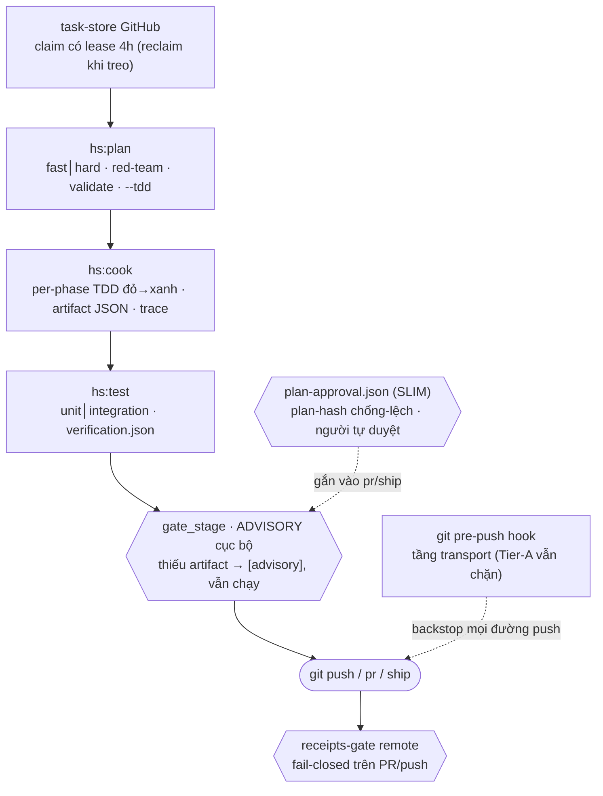

# SDLC Harness

Bộ kỷ luật SDLC **file-based cho Claude Code** — skills + hooks + scripts + rules cài vào repo của từng dev, để code do agent/người viết ra **đi đúng quy trình** (plan → code → test → ship) và **theo chung chuẩn** của tổ chức.

<div align="center">

### 🎮&nbsp; [▶ Mở showcase online](https://hieubui2409.github.io/sdlc-harness-showcase/) &nbsp;🎮

Bản tham quan tương tác toàn bộ tính năng — song ngữ EN/VI, chạy thẳng trên trình duyệt. Hoặc mở `docs/public/index.html` cục bộ.

</div>

## Tư tưởng

1. **Hai lớp kiểm soát.** Lớp chỉ dẫn (prose skill/rules — hướng dẫn agent làm đúng) + lớp gate runtime (hook chặn thật ở PreToolUse — không tin prose, kiểm bằng artifact). Mỗi gate khai báo phải có wiring thật.
2. **Multi-user kiểu phân tán.** Mỗi dev một máy, một clone, một harness riêng. Cái chung là **bộ chuẩn** (system-architecture + code-standards) nạp làm input trên từng máy — không phải nhiều người chung một máy (DEC-15). Lớp remote hai-tầng đang thiết kế là *bổ sung*, không đảo nguyên tắc này.
3. **Trace mọi thứ, nói thật về giới hạn.** Mọi gate/approval/DEC emit event có `actor` vào sổ audit không xoay vòng. Giới hạn ghi thẳng trong contract: gate là *presence gate* (chống quên bước, chưa chống gian lận), actor là *attribution* (không phải authentication), config gate *tamper-visible* (sửa được khi khẩn cấp nhưng lộ vết).

## Cấu trúc repo

| Đường dẫn | Là gì |
|---|---|
| `harness/` | Source of truth của sản phẩm: 59 hook, 159 script, 118 skill trong một plugin `hs` (bản cài mới **mặc-định-tắt** — 16 skill luôn bật (13 lõi SDLC + use + find-skills + cleanup), 102 còn lại bật theo nhu cầu qua `/hs:use`), 26 agent, 19 rule, 41 data yaml (gồm `output.yaml` chọn ngôn ngữ output), schemas, install (gồm `install.py` project/global + `bootstrap`/`_wire_env`/`_harden_bin` cho global + `courier_tree`/`bin/harness`/`harness_lifecycle` cho luồng courier), tests |
| `docs/` | Kiến trúc (`system-architecture.md` thin nạp-context + `docs/harness/system-architecture.md` chi tiết), chuẩn code, roadmap, PDR, phối hợp đa-agent, telemetry, AFK, decisions, STANDARDIZE — đọc `docs/harness/codebase-summary.md` trước |
| `docs/showcase/` | Nguồn trang showcase standalone (build ra `docs/public/index.html` qua `build.py`) |
| `plans/` | Kế hoạch active + báo cáo nghiên cứu/red-team/validation |
| `BACKLOG.md` | Sổ duy nhất cho việc-để-làm-sau (findings hoãn, hạng mục cần user) |
| `CLAUDE.md` | Hướng dẫn agent làm việc với repo này (tiếng Anh — bề mặt chỉ-thị) |
| `.claude/` | ClaudeKit toolkit (công cụ dev — **không phải sản phẩm**, không sửa/ref lúc chạy) |

## Bộ skill `hs:*`

Toàn bộ đóng gói trong plugin `hs`, gọi `/hs:<tên>`. Theo họ:

| Họ | Skill |
|---|---|
| **Xương sống SDLC** | `plan` · `cook` · `test` · `ship` |
| **Điều phối (orchestrator)** | `discover` · `triage` · `understand` · `team` · `find-skills` |
| **Chất lượng / review** | `code-review` · `review-pr` · `security-scan` · `scenario` · `predict` · `eval-bootstrap` |
| **Gỡ lỗi / sửa** | `debug` · `fix` · `problem-solving` |
| **Nghiên cứu / tri thức** | `research` · `scout` · `repomix` · `docs-seeker` · `graphify` · `tech-graph` · `context-engineering` · `sequential-thinking` · `fable-thinking` |
| **Sản phẩm / tư vấn (PO·BA)** | `spec` · `shape` · `advise` · `issue-to-plan` |
| **Engine thứ-hai / phối hợp agent** | `partner` · `gemini` · `coding-agent-orchestration` |
| **Ý tưởng / quyết định** | `brainstorm` · `loop` · `prompt` |
| **Tài liệu / sơ đồ** | `docs` · `journal` · `retro` · `preview` · `mermaidjs` · `excalidraw` · `document-skills` |
| **Tạo primitive (xây chính harness)** | `skill-creator` · `harness-creator` · `mcp-builder` · `agentize` · `bootstrap` |
| **Vận hành dự án** | `project-management` · `project-organization` · `plans-kanban` · `git` · `worktree` |
| **Tự động (AFK)** | `afk` |

Skill chỉ là prose chỉ-dẫn (tiếng Anh). Lớp chặn thật nằm ở hook + script. **13 skill lõi** (`plan·cook·test·ship·fix·debug·code-review·review-pr·git·scout·understand·setup·triage`) luôn bật và không tắt được; cùng `use`/`find-skills`/`cleanup` tạo thành **16 skill floor luôn bật**. 102 skill còn lại trong catalog rộng (gồm cả nhánh không-SDLC như frontend/mobile/media…) **mặc-định-tắt**, bật theo nhu cầu qua `/hs:use <tên>` hoặc `/hs:find-skills`.

## Ba hạng hook

| Hạng | Default | Khi lỗi | Vai trò |
|---|---|---|---|
| `telemetry` | ON | fail-open im lặng | ghi nhận |
| `nudge` | OFF | advisory stderr | nhắc nhở |
| `compliance` | **ON + blocking** | **fail-closed** exit 2 + cách xử lý | chốt chặn |

Hạng khắc trong code từng hook — config (`harness-hooks.yaml`, tracked git) chỉ bật/tắt và đổi mode, không đổi được hạng.

## Luồng chuẩn (W1 pipeline + W2 phối hợp)

**Personal-first (DEC-215):** gate cục bộ chỉ **advisory** — thiếu artifact thì in `[advisory]` + trace `gate_advisory` rồi **cho chạy tiếp**, KHÔNG chặn. Chốt chặn thật ở **remote**: workflow `receipts-gate` (`.github/workflows/receipts-gate.yml`) fail-closed trên PR/push. `plan-approval` là bản **SLIM**: chỉ chống-lệch bằng plan-hash + graph sidecar + người tự duyệt — bỏ hết roster/quorum/reviewer∈owners.



Nhịp dừng hỏi người: `HARNESS_AUTONOMY=default` (dừng ở plan-approve + ship) · `ask_all` · `god`. Mọi gate/approval/claim emit trace có `actor` vào sổ audit không xoay vòng; telemetry đo skill/script-run + chuỗi skill thực-tế-vs-khai-báo. Báo cáo do skill sinh ra đi theo `harness/data/output.yaml` (`language:` mặc định `vi`) và lọc qua rule humanizer trước khi chốt.

## Bắt đầu

```bash
# Yêu cầu: Linux, Python ≥3.9, git, Claude Code
python3 harness/scripts/preflight_deps.py        # check PyYAML + pytest, in lệnh cài nếu thiếu
python3 -m pytest harness/tests/ -q              # unit + invariants
bash scripts/ci_local.sh                         # toàn bộ job CI chạy local
python3 harness/e2e/run_vertical_slice.py        # e2e advisory-then-pass (temp dir)
python3 harness/scripts/verify_install.py --strict   # so hash + đăng ký hook
python3 harness/scripts/analyze_telemetry.py --lens all   # đọc telemetry (read-only)
```

## Cài đặt — 2 mô hình + luồng courier

Harness có **2 mô hình cài** (project / global) và **1 luồng giao mới (courier)**. Ví như bếp: **project** = mỗi nhà một cái bếp riêng; **global** = một bếp chung cho cả khu, mỗi nhà chỉ giữ tủ đồ riêng; **courier** = vẫn cái bếp-chung đó, nhưng **chuyển phát tới tận máy** qua plugin marketplace thay vì lắp tay.

| | **Project** (mặc định) | **Global** (`--global`) |
|---|---|---|
| Copy cả cây harness vào repo? | ✅ có, mỗi repo một bản | ❌ không — hook trỏ `$HARNESS_BIN_ROOT` |
| Binary dùng chung nhiều project? | ❌ không | ✅ MỘT bản chung |
| Data riêng từng project | trong cây đã copy | trong `.harness/` của project |
| Config (RBAC/policy/ngôn ngữ) | riêng repo | **chung** cả bin (DEC-225) |

**Project mode — cài từ bản release** (một lệnh): tải bundle + `install.sh` (hai asset của release) rồi chạy `sh install.sh harness-v<version>.tar.gz <repo đích>` (kiểm deps → cài → verify → chạy test; `--skip-tests` để bỏ test). Windows (PowerShell): `pwsh -File install.ps1 harness-v<version>.tar.gz <repo đích>` (`-SkipTests` để bỏ test), hợp cả PowerShell 5.1 lẫn 7+.

**Global mode — một binary chung cho nhiều project:**

```bash
python3 harness/install/install.py --target <project đích> --global
```

Chế độ này: hook trỏ `$HARNESS_BIN_ROOT` (không copy cây); env (`HARNESS_BIN_ROOT` + tùy chọn `HARNESS_DATA_ROOT`) ghi vào `settings.local.json` của project (không commit) → **cần RESTART session** mới ăn; tự **bootstrap** khung `.harness/` cho project; **từ chối** khi repo đích còn cây `harness/` cũ (phải gỡ trước, không auto-migrate). Cờ opt-in `--harden-bin` = chmod bin read-only ở tầng OS — đây là **hàng rào THẬT** duy nhất chặn Bash-write vào bin chung mà lớp hook không thấy (nói thẳng: hook chỉ chặn tool-Write). Repo này chính là bin chung khi chạy dogfood (`HARNESS_BIN_ROOT` để trống = self-host). Chi tiết đầy đủ: **`docs/harness/global-install-guide.md`**; nạp chuẩn tổ chức / smoke test: `docs/harness/deployment-guide.md`.

**Courier — giao mô hình global qua plugin marketplace (mới):** thay vì gõ `install.py --global`, harness ship như **một plugin Claude Code** cài từ marketplace. Cache plugin **mỏng** (chỉ `bin/` + `engine/` + `.claude-plugin/`, KHÔNG chạy skill trực tiếp từ cache) — nó là **người đưa thư** mang engine tới máy. Luồng:

```bash
# 1) cài plugin "harness" từ marketplace CC → có lệnh `harness` trên PATH
# 2) trong mỗi repo đích:
harness setup            # copy engine → ~/.local/share/harness/<version> (+ pointer `current`), wire per-project
harness upgrade          # nâng cấp: copy+verify+swap `current` sang bản mới (side-by-side, không đụng wiring)
harness doctor           # kiểm integrity engine (manifest-hash)
harness setup --pin      # khoá repo vào 1 version-dir cố định (miễn nhiễm `current` xê dịch)
```

`setup` copy engine ra **home read-only chung** rồi wire `HARNESS_BIN_ROOT` **per-project** vào `settings.local.json` (F3 — KHÔNG BAO GIỜ ghi global `~/.claude`), materialize hook + repoint marketplace tới engine. Về mặt kiến trúc courier **tái dùng nguyên** bộ máy two-zone của global (DEC-224/225) — chỉ khác **cách giao**: qua plugin + engine-home có version + pointer `current`, thay vì lắp tay. Bản courier **lược bỏ** `harness/tests/` + `harness/e2e/` khỏi payload (đồ dev/CI) → verify bằng `harness doctor`, không phải pytest. Lệch version plugin-vs-engine chỉ **cảnh báo advisory** ở SessionStart + `harness doctor`, không hard-block. Chi tiết: **`docs/harness/global-install-guide.md`** (mục courier) + `docs/harness/deployment-guide.md`.

Xem trực quan toàn bộ tính năng: mở `docs/public/index.html` trong trình duyệt, hoặc
bản online tại **https://hieubui2409.github.io/sdlc-harness-showcase/**. Site đó
build từ `showcase/` (`python3 showcase/build.py`) rồi publish sang repo công khai
riêng `hieubui2409/sdlc-harness-showcase` (GitHub Pages); repo harness này giữ private.

## Hướng đi tiếp (vision)

Hai-tầng kiểm soát **local + remote**: giữ nguyên một-clone-một-dev, thêm một sidecar server tùy chọn để team/doanh nghiệp tập trung **policy, telemetry, và phê duyệt gate có chữ ký** (Ed25519) — offline-first, fail-safe, không khóa khi server vắng.
